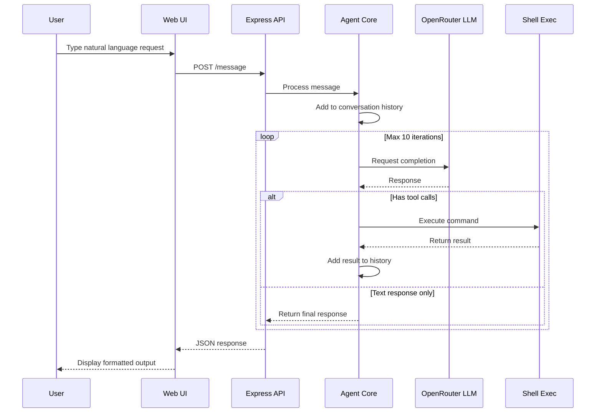

# NervShell

An AI-powered shell agent that gives a large language model direct access to your machine's command line. Send natural language instructions over HTTP and let the agent figure out the commands.

## Table of Contents

- [Architecture Overview](#architecture-overview)
- [System Flow](#system-flow)
- [Project Structure](#project-structure)
- [Technology Stack](#technology-stack)
- [Setup & Installation](#setup--installation)
- [Configuration](#configuration)
- [API Reference](#api-reference)
- [Tool System](#tool-system)
- [Agent Loop](#agent-loop)
- [Extending Tools](#extending-tools)
- [Security Considerations](#security-considerations)
- [Troubleshooting](#troubleshooting)

---

## Architecture Overview

```
┌─────────────────┐     HTTP      ┌──────────────────┐     API      ┌──────────────┐
│   Web Browser   │ ◄────────────► │  Express Server  │ ◄───────────► │  OpenRouter  │
│  (UI at :3000)  │                │    (Node.js)     │               │   (LLM API)  │
└─────────────────┘                └────────┬─────────┘               └──────────────┘
                                            │
                                            │ Child Process
                                            ▼
                                     ┌──────────────┐
                                     │  Shell Exec  │
                                     │  (tools.ts)  │
                                     └──────────────┘
```

**System Components:**

| Component | File | Responsibility |
|-----------|------|----------------|
| HTTP Server | src/index.ts | Express routes, static files, request handling |
| Agent Core | src/agent.ts | LLM communication, conversation state, tool orchestration |
| Tool Engine | src/tools.ts | Shell command execution, tool definitions |
| Web UI | public/ | Interactive chat interface |

**Data Flow:**

| Direction | Protocol | From | To |
|-----------|----------|------|-----|
| Request | HTTP | Web Browser | Express Server |
| API Call | HTTPS | Express Server | OpenRouter LLM |
| Execution | Child Process | Tool Engine | Host Shell |

---

## System Flow



---

## Project Structure

| Path | Type | Description |
|------|------|-------------|
| src/index.ts | Source | Express server, route handlers, static file serving |
| src/agent.ts | Source | AI agent: LLM client, conversation history, tool loop |
| src/tools.ts | Source | Tool definitions and shell command execution |
| public/index.html | Asset | Main HTML structure |
| public/style.css | Asset | UI styling |
| public/app.js | Asset | Frontend JavaScript |
| dist/ | Generated | Compiled TypeScript output |
| .env | Config | Environment variables (not in git) |
| .env.example | Config | Environment template |
| package.json | Config | Dependencies and scripts |
| tsconfig.json | Config | TypeScript configuration |

---

## Technology Stack

| Layer | Technology | Version | Purpose |
|-------|------------|---------|---------|
| Runtime | Node.js | 18+ | JavaScript runtime |
| Language | TypeScript | 5.9+ | Type-safe development |
| Framework | Express | 5.2+ | HTTP server |
| LLM Client | OpenAI SDK | 6.25+ | OpenRouter API compatibility |
| Validation | Zod | 4.3+ | Schema validation |
| Process | child_process | built-in | Shell execution |
| Dev Tool | tsx | 4.21+ | Hot reload dev server |

---

## Setup & Installation

### Prerequisites

- Node.js 18 or higher
- OpenRouter API key (free tier available)

### Installation Steps

1. Install dependencies
2. Configure environment by copying .env.example to .env
3. Edit .env and set OPENROUTER_API_KEY

### Running

| Command | Purpose |
|---------|---------|
| npm run dev | Development with hot reload |
| npm run build | Compile TypeScript to dist/ |
| npm start | Run production build |

---

## Configuration

### Environment Variables

| Variable | Required | Default | Description |
|----------|----------|---------|-------------|
| OPENROUTER_API_KEY | Yes | - | API key from openrouter.ai/keys |
| OPENROUTER_MODEL | No | google/gemini-2.0-flash-exp:free | Model identifier |
| PORT | No | 3000 | HTTP server port |

### Available Models (Free Tier)

| Model | Provider | Rate Limits |
|-------|----------|-------------|
| google/gemini-2.0-flash-exp:free | Google | 15 RPM |
| deepseek/deepseek-chat:free | DeepSeek | 10 RPM |
| meta-llama/llama-3.3-70b-instruct:free | Meta | 10 RPM |

---

## API Reference

### Endpoints Overview

| Method | Endpoint | Description |
|--------|----------|-------------|
| POST | /message | Send message to agent |
| GET | /history | Get conversation history |
| POST | /clear | Clear conversation history |
| GET | /health | Health check |
| GET | / | Web UI (static) |

### POST /message

Send a natural language message to the AI agent.

**Request Body:**
| Field | Type | Required | Description |
|-------|------|----------|-------------|
| message | string | Yes | Natural language instruction |

**Error Responses:**
| Status | Cause |
|--------|-------|
| 400 | Missing or invalid message field |
| 429 | LLM provider rate limit exceeded |
| 500 | Agent processing error |

### GET /history

Retrieve full conversation history.

Returns array of conversation messages with roles: system, user, assistant, tool.

### POST /clear

Reset conversation history to initial system prompt only.

---

## Tool System

### Current Tools

| Tool | Function | Parameters | Returns |
|------|----------|------------|---------|
| executeCommand | Run shell command | command: string | ToolResult object |

### Tool Execution Flow

```
┌─────────────┐    ┌──────────────┐    ┌─────────────┐    ┌──────────────┐
│ LLM decides │───►│ Agent parses │───►│ runTool()   │───►│ Shell exec   │
│ to use tool │    │ function call│    │ dispatcher  │    │ (30s timeout)│
└─────────────┘    └──────────────┘    └─────────────┘    └──────────────┘
                                                               │
                                                               ▼
┌─────────────┐    ┌──────────────┐    ┌─────────────┐    ┌──────────────┐
│ Agent loops │◄───│ Result added │◄───│ Format as   │◄───│ ToolResult   │
│ for more    │    │ to history   │    │ JSON string │    │ object       │
└─────────────┘    └──────────────┘    └─────────────┘    └──────────────┘
```

### Tool Result Schema

| Field | Type | Description |
|-------|------|-------------|
| tool | string | Tool name |
| success | boolean | Execution status |
| output | string | stdout, stderr, or error message |

---

## Agent Loop

The agent implements a ReAct-style loop for multi-step reasoning.

### Loop Flow

```
Initialize with system prompt
         │
         ▼
    ┌─────────┐
    │ Receive │
    │  user   │
    │ message │
    └────┬────┘
         │
         ▼
┌─────────────────┐
│ Call LLM with   │◄─────────────────────────┐
│ conversation    │                          │
│ history + tools │                          │
└────────┬────────┘                          │
         │                                    │
         ▼                                    │
    ┌─────────┐                               │
    │ Response │                              │
    │ has tool │──Yes──► Execute tool ────────┤
    │  calls?  │         Add result to history│
    └────┬────┘                               │
         │ No                                 │
         ▼                                    │
    ┌─────────┐                               │
    │ Return  │                               │
    │  final  │                               │
    │ response│                               │
    └─────────┘                               │
         │                                    │
         ▼                                    │
    Max 10 iterations ────────────────────────┘
```

### Loop Safety

| Safeguard | Value | Purpose |
|-----------|-------|---------|
| Max iterations | 10 | Prevent infinite loops |
| Command timeout | 30s | Prevent hanging processes |
| Max buffer | 1MB | Prevent memory exhaustion |

---

## Extending Tools

To add a new tool:

1. Define Tool Schema in src/tools.ts
2. Implement Handler function
3. Update System Prompt in src/agent.ts

---

## Security Considerations

| Risk | Mitigation |
|------|------------|
| Arbitrary command execution | Run only in trusted environments or containers |
| Network exposure | Do not expose to public internet without authentication |
| API key exposure | Store in .env, never commit to git |
| Resource exhaustion | 30s timeout, 1MB buffer limit on commands |
| Prompt injection | Zod schema validation on all tool inputs |

### Recommended Deployment

```
┌─────────────┐     ┌──────────────┐     ┌─────────────┐
│   User      │────►│  Reverse     │────►│  NervShell  │
│   Browser   │     │  Proxy       │     │  (Docker)   │
└─────────────┘     │  (Auth)      │     └─────────────┘
                    └──────────────┘
```

---

## Troubleshooting

### Common Issues

| Symptom | Cause | Solution |
|---------|-------|----------|
| 429 Provider returned error | Rate limit exceeded | Wait 60s or switch model in .env |
| Error: OPENROUTER_API_KEY required | Missing API key | Add key to .env file |
| Commands timeout | Long-running process | Increase timeout in tools.ts |
| Build errors | TypeScript issues | Run npm install then npm run build |
| UI not loading | Static files not served | Ensure public/ exists and rebuild |

---

## License

ISC
