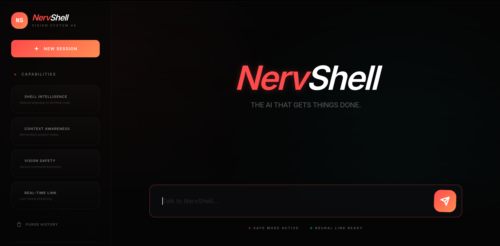

# NervShell: Personal AI Assistant

An autonomous, personal AI assistant dashboard that translates natural language instructions into safe workspace actions and system commands. Built on top of Express, Vite, Tailwind CSS (v4), and OpenRouter APIs.



## Architecture Overview

```
 ┌──────────────────────┐      REST API      ┌────────────────────┐      API       ┌─────────────────┐
 │   Web Browser Client │ ◄────────────────► │   Express Server   │ ◄────────────► │   OpenRouter    │
 │ (Landing / Dashboard)│                    │     (Node.js)      │                │    (LLM API)    │
 └──────────────────────┘                    └─────────┬──────────┘                └─────────────────┘
                                                       │
                                                       │ Path Scans & Child Process
                                                       ▼
                                            ┌─────────────────────┐
                                            │ Workspace Exec      │
                                            │ (File Tree / CLI)   │
                                            └─────────────────────┘
```

---

## Key Capabilities

- 🖥️ **Minimal Technical IDE Layout**: Shipped a flat, clean slate-tinted light-theme dashboard design (avoiding glassmorphism) consisting of 3-pane workspaces.
- 📁 **Workspace File Tree Explorer**: Browse the repository workspace folder structure directly from the dynamic sidebar explorer.
- 🔗 **System OS Connection Switch**: Toggle connection status in the sidebar:
  - *Workspace Mode (Disconnected)*: Access is strictly locked down to the repository directory.
  - *System OS Mode (Connected)*: Directory scopes expand to the home directory (`~` or `/home/rajan`) for system-wide operations.
- 📊 **Diagnostic Telemetry Dashboard**: Polls active CPU loads, core usage, RAM metrics, OS platform, and uptime gauges in real time.
- 🛡️ **Safe Mode Execution Policy (Default On)**: Prompts the user with a warning decider box displaying the proposed CLI command before running any shell process. Halt, approve, or reject tasks.
- 💬 **Conversation Sessions Manager**: Spin up independent sessions dynamically and persist conversation logs locally across server restarts.
- ✏️ **Frictionless Markdown Parser**: Fenced code blocks with Copy buttons, bold, italic, links, lists, and HTML tables are parsed cleanly.

---

## Project Structure

| Component | Path | Description |
|-----------|------|-------------|
| **Server Engine** | `src/server/index.ts` | Express routing gateway, telemetry metrics, settings, and workspace APIs. |
| | `src/server/agent.ts` | OpenRouter API wrapper, assistant logic loop, and execution approvals. |
| | `src/server/tools.ts` | Tool definitions (`executeCommand`, `readFile`, `writeFile`, `listFiles`, `getSystemInfo`, `webSearch`). |
| | `src/server/session.ts` | Sessions CRUD manager persisting conversation states to `.sessions.json`. |
| **Client UI** | `src/client/app.ts` | Client state coordinator, navbar triggers, and API transmission loops. |
| | `src/client/components/` | Modular views for `Sidebar`, `Chat`, `Input`, and `Workspace` panels. |
| | `src/client/utils/` | Custom lightweight `markdown` renderer. |
| | `src/client/styles/main.css` | Minimalist IDE stylesheet config (Tailwind CSS v4). |

---

## API Reference

### 1. Sessions Management
- `GET /api/sessions`: Returns list of saved conversation summaries.
- `POST /api/sessions`: Creates a new session `{ id, title }`.
- `DELETE /api/sessions/:id`: Deletes session logs.

### 2. Workspace & OS Diagnostics
- `GET /api/workspace`: Returns directory structure list of relative/system files.
- `GET /api/system`: Obtains CPU cores, active loads, RAM stats, and uptime.
- `POST /api/settings`: Updates model configs or connects/disconnects System OS toggles `{ model, systemConnected }`.

### 3. Agent Execution Loop
- `POST /message`: Submits query `{ message, sessionId, safeMode }`. If Safe Mode halts CLI task, returns:
  `{ status: "awaiting_approval", toolCall: { id, name, command } }`.
- `POST /api/approve`: Approves/rejects pending CLI task `{ sessionId, toolCallId, approved, command, safeMode }`. Returns next AI response stream.
- `GET /history?sessionId=id`: Obtains session messages.
- `POST /clear`: Clears session log `{ sessionId }`.

---

## Setup & Running

### Prerequisites
- Node.js 18 or higher
- OpenRouter API Key (placed in `.env` variable `OPENROUTER_API_KEY`)

### Installation
1. Install dependencies:
   ```bash
   npm install
   ```
2. Setup environment keys:
   ```bash
   cp .env.example .env
   # Edit .env and enter your OpenRouter key
   ```

### Running Scripts
- **Development**:
  ```bash
  npm run dev
  ```
  Runs Vite dev server on `http://localhost:5173` and Express on `http://localhost:3000` concurrently with hot reloading.
- **Production Build**:
  ```bash
  npm run build
  npm start
  ```
  Compiles Vite assets and TypeScript server, running production build on `http://localhost:3000`.

---

## Security Considerations

- **Path Resolution Boundary**: When disconnected, path parameters are resolved using a strictly locked boundary validation check preventing path traversal attacks.
- **Command Injection Safety**: Safe Mode halts raw shell execution loops. Running processes requires browser approval validation before triggers.
